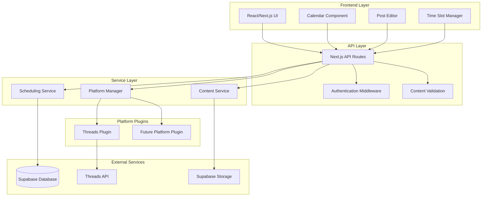

# Design Document

## Overview

The Social Media Scheduler is a web-based SaaS application built with a modern tech stack featuring React/Next.js frontend, Supabase backend, and Coolify deployment. The system uses a modular, plugin-based architecture to support multiple social media platforms while maintaining clean separation of concerns. The initial implementation focuses on Threads integration with a foundation that easily accommodates future platform additions.

## Architecture

### High-Level Architecture



### Technology Stack

- **Frontend**: Next.js 14 with React 18, TypeScript, Tailwind CSS
- **Backend**: Next.js API Routes, Supabase (PostgreSQL + Auth + Storage)
- **Deployment**: Coolify on VPS
- **Scheduling**: Node-cron for job execution
- **State Management**: Zustand for client-side state
- **UI Components**: Radix UI primitives with custom styling
- **Calendar**: React Big Calendar or FullCalendar integration

## Components and Interfaces

### Core Components

#### 1. Calendar View Component
```typescript
interface CalendarViewProps {
  posts: ScheduledPost[]
  onPostSelect: (post: ScheduledPost) => void
  onDateSelect: (date: Date) => void
  view: 'month' | 'week' | 'day'
}

interface ScheduledPost {
  id: string
  content: PostContent
  scheduledTime: Date
  platform: Platform
  status: 'scheduled' | 'published' | 'failed'
  userId: string
}
```

#### 2. Post Editor Component
```typescript
interface PostEditorProps {
  platform: Platform
  onSave: (post: PostDraft) => void
  initialContent?: PostContent
}

interface PostContent {
  type: 'single' | 'thread' | 'media'
  text: string
  mediaUrls?: string[]
  threadPosts?: string[]
  metadata: Record<string, any>
}
```

#### 3. Time Slot Manager
```typescript
interface TimeSlotConfig {
  dayOfWeek: 0 | 1 | 2 | 3 | 4 | 5 | 6 // Sunday = 0
  slots: TimeSlot[]
}

interface TimeSlot {
  id: string
  time: string // HH:MM format
  timezone: string
  isActive: boolean
}
```

### Platform Plugin Interface

```typescript
interface PlatformPlugin {
  name: string
  validateContent(content: PostContent): ValidationResult
  publishPost(content: PostContent, credentials: PlatformCredentials): Promise<PublishResult>
  getContentLimits(): ContentLimits
  getSupportedContentTypes(): ContentType[]
}

interface ThreadsPlugin extends PlatformPlugin {
  publishThread(posts: string[]): Promise<PublishResult>
  uploadMedia(file: File): Promise<string>
}
```

### API Endpoints

```typescript
// Posts Management
POST /api/posts - Create scheduled post
GET /api/posts - Get user's scheduled posts
PUT /api/posts/[id] - Update scheduled post
DELETE /api/posts/[id] - Delete scheduled post

// Time Slots
GET /api/time-slots - Get user's time slot configuration
PUT /api/time-slots - Update time slot configuration

// Scheduling
POST /api/schedule/next-slot - Schedule to next available slot
POST /api/schedule/custom - Schedule to custom time

// Platform Integration
GET /api/platforms - Get available platforms
POST /api/platforms/[platform]/auth - Authenticate with platform
POST /api/platforms/[platform]/test - Test platform connection
```

## Data Models

### Database Schema (Supabase/PostgreSQL)

```sql
-- Users table (handled by Supabase Auth)
-- Additional user profile data
CREATE TABLE user_profiles (
  id UUID REFERENCES auth.users(id) PRIMARY KEY,
  created_at TIMESTAMP WITH TIME ZONE DEFAULT NOW(),
  updated_at TIMESTAMP WITH TIME ZONE DEFAULT NOW(),
  timezone VARCHAR(50) DEFAULT 'UTC'
);

-- Time slot configurations
CREATE TABLE time_slots (
  id UUID DEFAULT gen_random_uuid() PRIMARY KEY,
  user_id UUID REFERENCES auth.users(id) ON DELETE CASCADE,
  day_of_week INTEGER CHECK (day_of_week >= 0 AND day_of_week <= 6),
  time TIME NOT NULL,
  timezone VARCHAR(50) DEFAULT 'UTC',
  is_active BOOLEAN DEFAULT true,
  created_at TIMESTAMP WITH TIME ZONE DEFAULT NOW()
);

-- Scheduled posts
CREATE TABLE scheduled_posts (
  id UUID DEFAULT gen_random_uuid() PRIMARY KEY,
  user_id UUID REFERENCES auth.users(id) ON DELETE CASCADE,
  platform VARCHAR(50) NOT NULL,
  content JSONB NOT NULL,
  scheduled_time TIMESTAMP WITH TIME ZONE NOT NULL,
  status VARCHAR(20) DEFAULT 'scheduled' CHECK (status IN ('scheduled', 'published', 'failed', 'cancelled')),
  published_at TIMESTAMP WITH TIME ZONE,
  error_message TEXT,
  created_at TIMESTAMP WITH TIME ZONE DEFAULT NOW(),
  updated_at TIMESTAMP WITH TIME ZONE DEFAULT NOW()
);

-- Platform credentials (encrypted)
CREATE TABLE platform_credentials (
  id UUID DEFAULT gen_random_uuid() PRIMARY KEY,
  user_id UUID REFERENCES auth.users(id) ON DELETE CASCADE,
  platform VARCHAR(50) NOT NULL,
  credentials JSONB NOT NULL, -- Encrypted OAuth tokens
  is_active BOOLEAN DEFAULT true,
  expires_at TIMESTAMP WITH TIME ZONE,
  created_at TIMESTAMP WITH TIME ZONE DEFAULT NOW(),
  UNIQUE(user_id, platform)
);

-- Indexes for performance
CREATE INDEX idx_scheduled_posts_user_time ON scheduled_posts(user_id, scheduled_time);
CREATE INDEX idx_scheduled_posts_status ON scheduled_posts(status);
CREATE INDEX idx_time_slots_user_day ON time_slots(user_id, day_of_week);
```

### TypeScript Types

```typescript
interface User {
  id: string
  email: string
  timezone: string
  createdAt: Date
}

interface ScheduledPost {
  id: string
  userId: string
  platform: string
  content: PostContent
  scheduledTime: Date
  status: 'scheduled' | 'published' | 'failed' | 'cancelled'
  publishedAt?: Date
  errorMessage?: string
}

interface TimeSlotConfig {
  id: string
  userId: string
  dayOfWeek: number
  time: string
  timezone: string
  isActive: boolean
}
```

## Error Handling

### Client-Side Error Handling
- Form validation with real-time feedback
- Network error recovery with retry mechanisms
- Graceful degradation for offline scenarios
- User-friendly error messages with actionable guidance

### Server-Side Error Handling
```typescript
class SchedulingError extends Error {
  constructor(
    message: string,
    public code: string,
    public statusCode: number = 500
  ) {
    super(message)
  }
}

// Error types
const ErrorCodes = {
  INVALID_CONTENT: 'INVALID_CONTENT',
  PLATFORM_AUTH_FAILED: 'PLATFORM_AUTH_FAILED',
  SCHEDULING_CONFLICT: 'SCHEDULING_CONFLICT',
  RATE_LIMIT_EXCEEDED: 'RATE_LIMIT_EXCEEDED',
  MEDIA_UPLOAD_FAILED: 'MEDIA_UPLOAD_FAILED'
} as const
```

### Platform-Specific Error Handling
- Threads API rate limiting and retry logic
- OAuth token refresh mechanisms
- Content validation failures with specific guidance
- Media upload error recovery

## Testing Strategy

### Unit Testing
- **Framework**: Jest + React Testing Library
- **Coverage**: All utility functions, hooks, and components
- **Platform Plugins**: Mock external API calls
- **Database Operations**: Use Supabase test environment

### Integration Testing
- **API Routes**: Test all endpoints with various scenarios
- **Database Operations**: Test CRUD operations and constraints
- **Platform Integration**: Test with sandbox/test APIs where available
- **Authentication Flow**: Test Supabase Auth integration

### End-to-End Testing
- **Framework**: Playwright
- **Scenarios**: 
  - Complete post scheduling workflow
  - Calendar navigation and interaction
  - Time slot configuration
  - Platform authentication
  - Post publishing verification

### Performance Testing
- **Database Query Optimization**: Test with large datasets
- **API Response Times**: Ensure sub-200ms response times
- **Frontend Performance**: Lighthouse scores > 90
- **Concurrent User Testing**: Test scheduling conflicts

## Security Considerations

### Authentication & Authorization
- Supabase Auth with JWT tokens
- Row Level Security (RLS) policies for all tables
- API route protection with middleware
- Platform credential encryption at rest

### Data Protection
- Input sanitization and validation
- SQL injection prevention through parameterized queries
- XSS protection with Content Security Policy
- Rate limiting on API endpoints

### Platform Integration Security
- OAuth 2.0 for platform authentication
- Secure credential storage with encryption
- Token refresh handling
- Scope limitation for platform permissions

## Deployment Architecture

### Coolify Configuration
```yaml
# docker-compose.yml for Coolify
version: '3.8'
services:
  app:
    build: .
    ports:
      - "3000:3000"
    environment:
      - NEXT_PUBLIC_SUPABASE_URL=${SUPABASE_URL}
      - NEXT_PUBLIC_SUPABASE_ANON_KEY=${SUPABASE_ANON_KEY}
      - SUPABASE_SERVICE_ROLE_KEY=${SUPABASE_SERVICE_ROLE_KEY}
      - NEXTAUTH_SECRET=${NEXTAUTH_SECRET}
    volumes:
      - ./uploads:/app/uploads
    restart: unless-stopped
```

### Environment Configuration
- Production environment variables through Coolify
- Supabase connection strings and API keys
- Platform API credentials (Threads)
- Monitoring and logging configuration

### Monitoring & Logging
- Application performance monitoring
- Error tracking and alerting
- Database performance monitoring
- Scheduled job execution logging